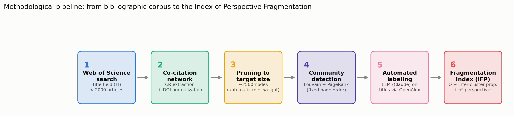
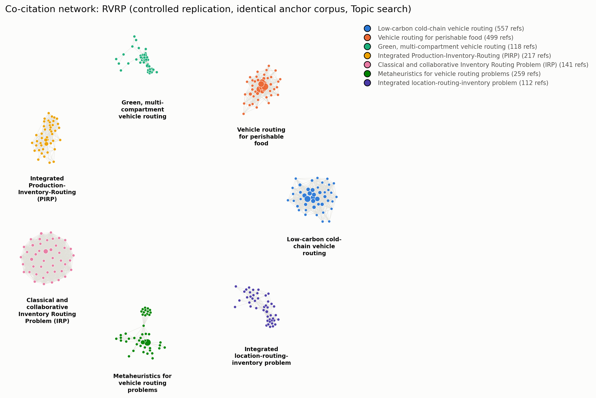
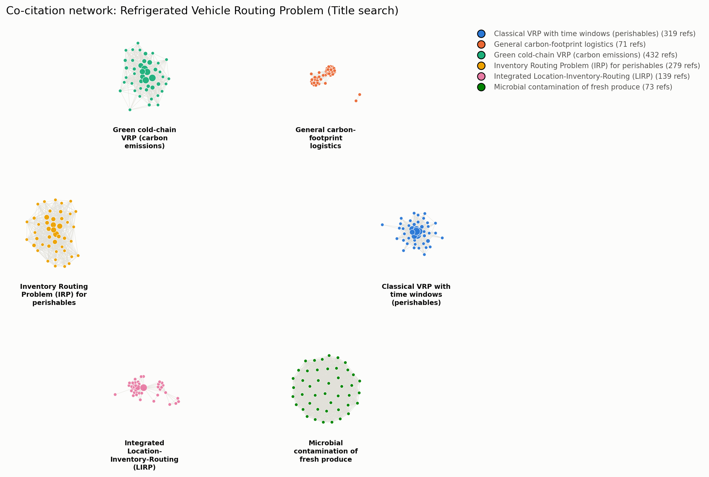
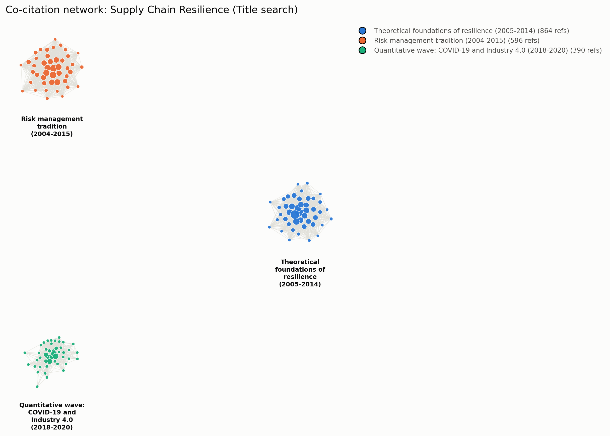
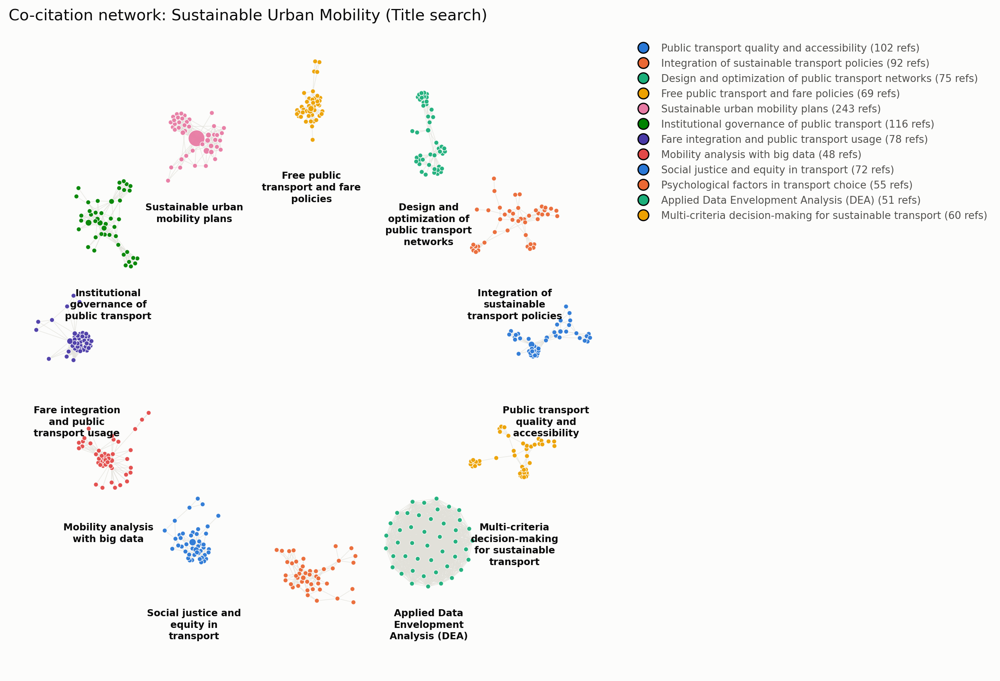
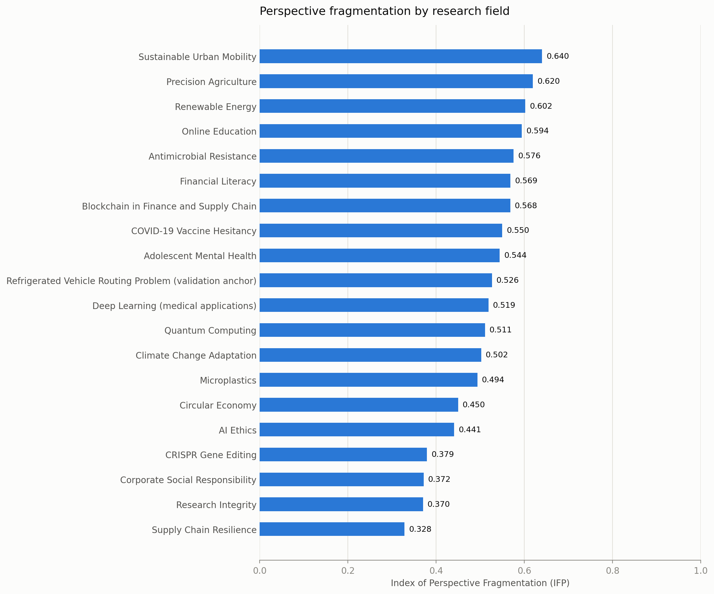

# The Index of Perspective Fragmentation: An Automated, Comparative Co-Citation Analysis Across Twenty Research Fields

Daniel Aristizábal Torres¹\* & Ana María Barrera Rodríguez²

¹ Faculty of Engineering, Universidad Libre Seccional Pereira, Pereira, Colombia

² Facultad de Ciencias Económicas, Administrativas y Contables, Universidad Libre Seccional Pereira, Pereira, Colombia

\* Corresponding author: daniel.aristizabalt@unilibre.edu.co

---

## Abstract

Co-citation analysis has long been used to map the "intellectual structure" of a research field — the distinct schools of thought, or *perspectives*, that a body of literature organizes itself into. Traditionally this mapping is done by hand for a single field at a time, which makes it labor-intensive, difficult to reproduce, and — critically — impossible to compare across fields, since no two manual studies use the same corpus size, clustering parameters, or naming conventions. We present an automated, end-to-end pipeline that standardizes this process: a Web of Science title-field search is converted into a co-citation network, pruned to a fixed target size regardless of raw corpus volume, partitioned into communities with the Louvain algorithm, ranked internally with PageRank, and automatically labeled using a large language model grounded in resolved reference titles. From these components we derive the **Index of Perspective Fragmentation (IFP)**, a composite measure combining network modularity, the proportion of inter-cluster citations, and the number of significant perspectives. We validate the pipeline against a manually constructed co-citation map of the Refrigerated Vehicle Routing Problem (RVRP) literature published in *Frontiers in Research Metrics and Analytics* (Aristizábal Torres et al., 2026), then apply it comparatively to 20 research fields spanning the natural sciences, social sciences, health, technology, and environmental science. IFP ranges from 0.328 (Supply Chain Resilience) to 0.640 (Sustainable Urban Mobility) and shows no significant correlation with corpus size (r = -0.220, p = 0.352 for article count; r = -0.128, p = 0.589 for network size), indicating that the index captures genuine structural properties of a field rather than an artifact of sample volume. We further document a recurring source of measurement bias — narrow, single-facet search queries that spuriously split a single coherent perspective into near-duplicate clusters — and the safeguards we developed against it. The pipeline, code, and full dataset are made publicly available.

**Keywords:** co-citation analysis, science mapping, community detection, research fragmentation, bibliometrics, large language models, comparative scientometrics

---

## 1. Introduction

Every research field has an intellectual structure: a set of foundational works that different groups of authors cite together, revealing shared theoretical commitments, methodological traditions, or application domains. Mapping this structure — identifying how many distinct *perspectives* a field contains, how isolated they are from one another, and what each one is actually about — has been a core task of scientometrics since Small (1973) introduced co-citation analysis and White and Griffith (1981) extended it to author-level mapping. This kind of mapping matters beyond bibliometrics itself: it helps editors and funders identify whether a field is converging toward consensus or fragmenting into isolated camps, helps new researchers orient themselves without reading the entire literature, and helps meta-scientists study how knowledge organizes itself as a field matures.

In practice, however, this kind of mapping is almost always done by hand, for one field at a time. A researcher exports a corpus, builds a co-citation network, runs a community-detection algorithm, and then manually inspects and names each resulting cluster based on domain expertise. This approach — exemplified by a recent manual co-citation study of the Refrigerated Vehicle Routing Problem (RVRP) literature (Aristizábal Torres et al., 2026), which identified four dominant research perspectives from a directed co-citation network of 3,116 nodes built in Gephi — produces rich, expert-validated maps, but it does not scale, and, more importantly for the present purpose, it is not *comparable*. Because corpus size, search strategy, clustering resolution, and naming conventions vary from study to study, there is no way to say whether Field A is more fragmented than Field B; the two numbers, even if both are reported, were not produced under conditions that make them commensurable.

This paper addresses that gap. We ask: can the entire pipeline — from literature search to named, interpretable perspectives — be automated in a way that (a) reproduces what an expert-driven manual analysis finds for a known field, and (b) yields a single comparable fragmentation score that can be computed, under identical conditions, for any research field? We answer both questions affirmatively. We build an automated pipeline that standardizes every step that would otherwise introduce incomparability between fields — most importantly, the *size* of the resulting co-citation network, which we show is not itself correlated with our fragmentation measure once standardized. We validate the pipeline against the manually constructed RVRP map, then apply it to 20 fields chosen for topical diversity, producing the first — to our knowledge — directly comparable cross-field ranking of perspective fragmentation.

Our contribution is threefold. First, a fully automated, reproducible co-citation-to-perspectives pipeline, including a large-language-model labeling step with a documented human quality-assurance protocol. Second, the Index of Perspective Fragmentation (IFP), a composite metric designed to be comparable across fields of very different literature volumes. Third, an empirical, 20-field comparative study — together with a robustness check ruling out corpus size as a confound — that documents which kinds of research fields fragment most, and identifies a previously undocumented source of measurement artifact (narrow, single-facet search queries producing spurious duplicate clusters) along with the diagnostic procedure we used to detect and correct it.

---

## 2. Related Work

**Co-citation and bibliographic coupling.** Co-citation analysis (Small, 1973) and its author-level extension (White & Griffith, 1981) remain the dominant approach to mapping a field's intellectual structure, complementing the earlier document-similarity approach of bibliographic coupling (Kessler, 1963). McCain (1990) formalized the general workflow — network construction, dimensionality reduction or clustering, and interpretation — that the present pipeline automates end to end.

**Community detection in citation networks.** Modularity-based community detection, particularly the Louvain algorithm (Blondel et al., 2008), has become the standard tool for partitioning co-citation and bibliographic-coupling networks into thematic clusters, building on the modularity framework of Newman (2006). A known but under-discussed property of Louvain is its sensitivity to node insertion order in unweighted or naively reconstructed graphs; we document a concrete instance of this problem and its fix (Section 3.5), a methodological caution that, to our knowledge, has not been explicitly reported in prior comparative bibliometric work.

**Science mapping software.** Tools such as CiteSpace (Chen, 2006), VOSviewer (van Eck & Waltman, 2010), and bibliometrix (Aria & Cuccurullo, 2017) have made single-field science mapping widely accessible, and overlay-mapping approaches (Rafols et al., 2010) have been used to visualize interdisciplinarity against a fixed backdrop of science. These tools, however, are designed for single-field, human-in-the-loop analysis; they do not standardize network size across corpora of different volumes, which is a prerequisite for the kind of cross-field comparison we pursue here.

**Diversity and interdisciplinarity metrics.** Our IFP is conceptually related to diversity indices used to quantify interdisciplinarity (e.g., Rafols & Meyer, 2010), in that both reduce a complex citation structure to a single comparable number. IFP differs in scope: rather than measuring how much a field draws on *external* disciplinary categories, it measures how internally split a field's own literature is into mutually distant co-citation communities.

**Automated labeling with language models.** The use of large language models to summarize or label clusters of scientific documents is a fast-growing but still largely undocumented practice in applied bibliometrics. We contribute a concrete, reproducible protocol — resolving top-PageRank references to real titles via OpenAlex, then prompting a language model for a short name and description — together with the human quality-assurance checks needed to catch a specific failure mode: near-duplicate cluster names produced when a single coherent perspective is spuriously split (Section 3.7).

---

## 3. Methods

### 3.1 Field selection

We selected 20 research fields for topical diversity, spanning the natural and physical sciences (CRISPR gene editing, quantum computing, microplastics), engineering and technology (precision agriculture, blockchain, renewable energy), health (antimicrobial resistance, adolescent mental health, COVID-19 vaccine hesitancy, medical applications of deep learning), social science and policy (financial literacy, corporate social responsibility, research integrity, sustainable urban mobility), and cross-cutting socio-technical domains (AI ethics, circular economy, climate change adaptation, online education, supply chain resilience). One field — the Refrigerated Vehicle Routing Problem (RVRP) — was selected specifically as an **anchor** field, because a manually constructed co-citation map of this exact literature had already been published (Aristizábal Torres et al., 2026), allowing direct validation of the automated pipeline against expert-driven ground truth.

### 3.2 Literature search and corpus construction

All corpora were retrieved from Web of Science using the **Title (TI)** search field exclusively. We deliberately avoided the Topic field, which searches abstracts and keywords in addition to titles and tends to produce much larger, more topically diffuse corpora; using a single, consistent search field across all 20 fields was necessary to keep search strategy from being itself a source of incomparability — an issue we discovered and corrected mid-project after finding that an early, methodologically inconsistent batch of fields mixed Title and Topic searches (see Section 3.7).

Within the Title field, queries were iteratively tuned to keep each corpus under approximately 2,000 records — large enough for a stable co-citation network, small enough to remain a single Web of Science export batch. Two failure modes had to be actively managed during query construction. First, queries that were too broad (in some cases returning tens of thousands of records) were narrowed using exact phrases and Boolean combinations. Second, and more consequentially, queries that were narrowed *along a single facet* (e.g., restricting a climate-adaptation query to a single governance-related phrase) were found to distort the resulting network by making the corpus artificially homogeneous, which in turn caused a single genuine perspective to be spuriously split into several near-identical clusters by the community-detection step (documented in detail in Section 3.7). The corrective heuristic we adopted was to widen narrow queries across *multiple* relevant facets (joined with OR) rather than to accept a single-angle query merely because it hit a target corpus size. Final corpus sizes across the 20 fields ranged from 310 to 1,809 articles (Table 1).

### 3.3 Co-citation network construction

Web of Science plain-text exports were parsed to extract the cited-reference (`CR`) field of every record. Each cited reference was normalized to a canonical node identity: where a DOI was present it was used directly; otherwise a normalized string (author, year, source) was used as a fallback. For every pair of references co-cited within the same citing article, an edge was added (or its weight incremented) between the two corresponding nodes, yielding a weighted, undirected co-citation network per field.

### 3.4 Network size standardization

Because raw corpus size varied roughly six-fold across fields (310 to 1,809 articles), and co-citation networks grow super-linearly with corpus size, comparing raw network statistics across fields would confound field-intrinsic structure with sample volume. We addressed this by pruning every network to a common **target size of approximately 2,500 nodes**, regardless of the size of the raw network it was derived from. Pruning was performed by removing edges below a minimum co-citation weight threshold (and any nodes left isolated by that removal); the threshold was searched incrementally until the resulting node count was closest to the 2,500-node target. This standardization is what makes the resulting fragmentation scores comparable across fields of very different literature volumes, and its effectiveness is confirmed by the robustness check in Section 4.3.

A reproducibility issue was identified and corrected during pipeline development: an early implementation of the pruning step reconstructed the pruned graph from a Python generator, which silently altered node insertion order and — because the Louvain algorithm's greedy local-optimization phase is sensitive to the order in which nodes are visited — produced different community partitions across repeated runs on what should have been the *same* network. The fix was to prune in place (copying the full graph and removing weak edges and resulting isolates, rather than rebuilding it from an iterator), which preserves the original node order and makes clustering results deterministic given a fixed random seed. We flag this as a general caution for any comparative bibliometric pipeline built on Louvain community detection.

### 3.5 Community detection and centrality

Each pruned network was partitioned using the Louvain modularity-optimization algorithm (Blondel et al., 2008) with a fixed random seed, using edge weight as the optimization weight. A cluster was considered a *significant perspective* if it contained at least 3% of the network's nodes (minimum 3 nodes); smaller clusters were treated as noise and excluded from perspective counts and labeling. Within each network, node centrality was computed via weighted PageRank (Page et al., 1999), used both to rank each cluster's most representative references and, for visualization, to select the top-N most central nodes per cluster for display.

### 3.6 Automated cluster labeling

For each significant cluster, the top-ranked references by PageRank were resolved to human-readable titles via the OpenAlex API (using the DOI where available; falling back to the raw cited-reference string otherwise). These titles were then passed to a large language model (Claude), prompted to produce a short (≤8-word) name and a one-sentence description of the research perspective they collectively represent. This step replaces the manual "read the top papers and name the cluster" step of traditional co-citation analysis with an automated, but still inspectable and correctable, procedure.

### 3.7 Quality assurance and artifact detection

Automated labeling and clustering are not immune to error, and we developed a two-part diagnostic protocol applied to every field before its results were accepted. First, each network was visualized using a community-aware layout (clusters anchored to distinct positions on a circle, with local force-directed layout within each cluster, restricted to intra-cluster edges among each cluster's top-PageRank nodes) to allow visual inspection of whether clusters were structurally well separated or merely artificially partitioned. Second, cluster names and their underlying sample titles were manually reviewed for near-duplication.

This protocol caught one clear artifact during pipeline development: a climate-change-adaptation query narrowed to a single governance-related facet produced a corpus in which Louvain split what was, on inspection, a single coherent governance perspective into several near-identical sub-clusters sharing the same foundational citations — a direct consequence of the single-facet query narrowing described in Section 3.2. Widening the query across multiple relevant facets resolved the artifact and is reflected in the final results reported here. In several other fields, near-identical cluster *names* were found on inspection to reflect genuine, structurally distinct sub-literatures rather than artifacts — for example, distinct co-citation communities organized around a shared statistical or methodological toolkit (e.g., structural-equation/PLS modeling literature, or panel-data econometric test literature) rather than around substantive topic, and communities distinguished by sub-population or time period (e.g., adolescent- versus child-focused pandemic mental-health literature; pre- versus post-2018 supply-chain-resilience literature). We report both patterns as a substantive finding in Section 4.4 rather than treating them as noise to be removed.

### 3.8 The Index of Perspective Fragmentation (IFP)

For each field, we compute three normalized components from its final pruned, clustered network:

1. **Modularity (Q)** — the standard Louvain modularity score of the final partition, which is bounded in [0, 1] for typical citation networks and measures how much more densely connected nodes are within clusters than between them.
2. **Inter-cluster citation proportion** — the fraction of total edge weight that connects nodes in *different* clusters (as opposed to the same cluster), directly measuring how citationally isolated the perspectives are from one another.
3. **Normalized perspective count** — the number of significant perspectives (Section 3.5), divided by 8 and capped at 1.0 (i.e., a field with 8 or more significant perspectives receives the maximum score on this component).

The Index of Perspective Fragmentation is the unweighted mean of these three components:

IFP = (Q + inter-cluster proportion + normalized perspective count) / 3

Each component captures a conceptually distinct aspect of fragmentation — how cleanly separated the clusters are (Q), how citationally isolated they are from each other (inter-cluster proportion), and how many of them there are (perspective count) — and combining all three guards against a field scoring as highly fragmented on the strength of only one dimension (for instance, many small clusters with heavy cross-citation, which would inflate a raw cluster count but not the other two components).

### 3.9 Validation against the anchor field

The anchor study (Aristizábal Torres et al., 2026) retrieved 469 RVRP articles from the Web of Science Core Collection using a **Topic**-field search (title, abstract, and keywords) restricted to journal articles, filtered through a PRISMA-inspired screening process. Cited references were exported and processed with the R-TOS package into a *directed* co-citation network of 3,116 nodes and 11,341 edges, visualized in Gephi with the Force Atlas 2 layout, and partitioned with Gephi's modularity-optimization algorithm (Q = 0.474). Nine communities were detected in total; the authors focused their interpretation on the four that concentrated the majority of structurally central, highly cited references (the largest containing 551 nodes, 17.7% of the network), analyzed via PageRank centrality and keyword frequency (word-cloud) analysis.

Our automated pipeline differs from this procedure in three respects, each a direct consequence of the design choices needed for cross-field comparability (Section 3.2–3.5): it searches the Title field only, rather than Topic, yielding a smaller and more precisely scoped corpus (393 vs. 469 articles); it builds an *undirected*, weight-pruned network rather than a directed one, standardized toward a fixed target size rather than left at its raw scale; and it defines a "significant" cluster by a fixed, mechanical size threshold (≥3% of network nodes) rather than by post hoc expert judgment of which communities are "dominant." These are intentional divergences, not implementation errors — they are precisely what is required to make a per-field procedure repeatable, in identical form, across 20 fields rather than tuned by hand for one.

To determine whether any resulting discrepancy is driven by this search-field difference or by the clustering procedure itself, we additionally ran a **controlled replication**: the exact same 469-record Web of Science export used in the anchor study (retrieved February 11, 2026, using its published Topic-field query) was passed through our own pipeline unmodified — network construction, pruning, Louvain clustering, PageRank, and LLM labeling — holding the corpus fixed and varying only the clustering methodology. This isolates the corpus/search-field variable from the network-representation/clustering-algorithm variable, which the Title-search comparison alone cannot do.

---

## 4. Results

### 4.1 Validation: the RVRP anchor field

The automated pipeline identified six significant perspectives in the Title-search RVRP corpus (IFP = 0.526, Q = 0.613, inter-cluster proportion = 0.216; n = 393 articles, pruned network = 1,630 nodes) and seven in the controlled, identical-corpus Topic-search replication (IFP = 0.564, Q = 0.549, inter-cluster proportion = 0.268; n = 469 articles, pruned network = 2,329 nodes) — both modularity values exceeding the anchor study's Q = 0.474, consistent with at least comparably well-defined community structure under either search strategy. Table 2 maps both automated results onto the anchor study's four manually interpreted perspectives.

**Table 2. Correspondence between the manually derived RVRP perspectives (Aristizábal Torres et al., 2026) and the automated clusters recovered by the present pipeline, under both the standard Title-search design and a controlled replication on the anchor study's identical Topic-search corpus.**

| Anchor perspective (manual, n=469, Topic search, directed network) | Automated, Title search (n=393) | Automated, controlled replication (n=469, identical corpus, Topic search) |
|---|---|---|
| P1. Algorithmic optimization and mathematical modeling | VRP with time windows for perishables (n=319); general carbon-footprint logistics (n=71) | VRPTW for perishables (n=499); metaheuristics for VRP (n=259) |
| P2. Logistics of perishable products and cold-chain operational management | Green cold-chain VRP with carbon emissions (n=432) | Cold-chain, low-carbon VRP (n=557); green/multi-compartment/pollution-routing VRP (n=118) |
| P3. Inventory-routing integration and strategic logistics coordination | Inventory Routing Problem (n=279); integrated Location-Inventory-Routing Problem (n=139) | Production-Inventory-Routing (PIRP, n=217); classical/collaborative IRP (n=141); integrated Location-Routing-Inventory Problem (n=112) |
| P4. Dynamic routing, intelligent systems, and multi-objective optimization | *Not recovered* | *Not recovered* |
| *(not present in anchor study)* | Microbial contamination of fresh produce (n=73) | *(absent — narrower Topic query does not match unrelated food-safety literature)* |

The controlled replication clarifies which of the two divergences observed under Title search are attributable to search-field coverage and which are attributable to the clustering methodology itself. The spurious microbial-contamination cluster present in the Title-search result **disappears** under the controlled replication, confirming it was a coverage artifact of the looser Title query (Section 3.2) rather than a property of the clustering algorithm. The absence of a distinct cluster corresponding to the anchor's Perspective 4 (dynamic, time-dependent, and multi-objective routing with intelligent transportation systems), however, **persists even on the anchor study's own corpus**: neither the Title-search nor the Topic-search automated run isolates it as a separate community. This rules out corpus coverage as the explanation and points instead to a genuine methodological difference between the two pipelines — most plausibly the anchor study's use of a *directed* co-citation network processed with Gephi's modularity algorithm, versus our *undirected*, weight-pruned network processed with Louvain, and/or the anchor study's use of expert judgment to designate four communities as "dominant" out of nine detected, versus our fixed 3%-of-nodes significance threshold applied uniformly across 20 fields. We report this as an honest limitation of the mechanical, threshold-based approach required for cross-field comparability (Section 6), not as a claim that Perspective 4 does not exist in the literature.

Beyond this one confirmed gap, both automated runs recover the substantive core of all three other anchor perspectives, and both resolve the anchor's Perspective 3 (inventory-routing integration) into multiple formally distinct operations-research problem classes that the manual study's four-perspective aggregation grouped together — the classical Inventory Routing Problem, a production-coordinated variant, and the more strategic, multi-echelon Location-Inventory-Routing Problem. This finer granularity is a direct, mechanical consequence of our significance threshold rather than an interpretive choice, and illustrates a general property of the pipeline: it tends to resolve more, smaller, formally distinguishable sub-communities than a human analyst focusing on a small number of "dominant" perspectives would.

Overall, the automated pipeline reproduces the structural core of the expert-driven manual analysis — the same algorithmic, cold-chain, and inventory-routing streams, at comparable or higher modularity — while surfacing a finer-grained decomposition of one perspective and missing another that the manual study's larger, Topic-based corpus was able to isolate. We read this as evidence that the pipeline is a credible, largely faithful substitute for the labor-intensive stages of manual co-citation mapping, with corpus scope (Title vs. Topic search) as the main lever governing where the two approaches diverge.

### 4.2 Comparative results across 20 fields

Table 1 reports the full results. IFP ranged from 0.328 (Supply Chain Resilience) to 0.640 (Sustainable Urban Mobility), a nearly two-fold range across fields searched, networked, pruned, and clustered under identical conditions.

**Table 1. IFP and component metrics across 20 research fields, ranked by IFP.**

+-----------------------------------------+----------------+-----------------+-------------------+--------------+------------------+-----------------------+
| Field                                   | Articles (n)   | Network nodes   | Perspectives      | IFP          | Modularity (Q)   | Inter-cluster prop.   |
+=========================================+================+=================+===================+==============+==================+=======================+
| Supply Chain Resilience                 |            534 |           1,892 |                 3 |        0.328 |            0.297 |                 0.313 |
+-----------------------------------------+----------------+-----------------+-------------------+--------------+------------------+-----------------------+
| Research Integrity                      |          1,053 |           1,956 |                 4 |        0.370 |            0.536 |                 0.075 |
+-----------------------------------------+----------------+-----------------+-------------------+--------------+------------------+-----------------------+
| Corporate Social Responsibility         |          1,617 |           2,075 |                 4 |        0.372 |            0.359 |                 0.256 |
+-----------------------------------------+----------------+-----------------+-------------------+--------------+------------------+-----------------------+
| CRISPR Gene Editing                     |          1,592 |           2,123 |                 4 |        0.379 |            0.308 |                 0.330 |
+-----------------------------------------+----------------+-----------------+-------------------+--------------+------------------+-----------------------+
| AI Ethics                               |            398 |           1,217 |                 5 |        0.441 |            0.572 |                 0.126 |
+-----------------------------------------+----------------+-----------------+-------------------+--------------+------------------+-----------------------+
| Circular Economy                        |            890 |           2,105 |                 5 |        0.450 |            0.301 |                 0.424 |
+-----------------------------------------+----------------+-----------------+-------------------+--------------+------------------+-----------------------+
| Microplastics                           |          1,204 |           2,077 |                 6 |        0.494 |            0.308 |                 0.422 |
+-----------------------------------------+----------------+-----------------+-------------------+--------------+------------------+-----------------------+
| Climate Change Adaptation               |          1,019 |           1,181 |                 6 |        0.502 |            0.554 |                 0.202 |
+-----------------------------------------+----------------+-----------------+-------------------+--------------+------------------+-----------------------+
| Quantum Computing                       |            412 |           2,519 |                 6 |        0.511 |            0.396 |                 0.385 |
+-----------------------------------------+----------------+-----------------+-------------------+--------------+------------------+-----------------------+
| Deep Learning (medical applications)    |            702 |             823 |                 6 |        0.519 |            0.708 |                 0.098 |
+-----------------------------------------+----------------+-----------------+-------------------+--------------+------------------+-----------------------+
| RVRP (validation anchor)                |            393 |           1,630 |                 6 |        0.526 |            0.613 |                 0.216 |
+-----------------------------------------+----------------+-----------------+-------------------+--------------+------------------+-----------------------+
| Adolescent Mental Health                |          1,319 |           1,376 |                 7 |        0.544 |            0.457 |                 0.300 |
+-----------------------------------------+----------------+-----------------+-------------------+--------------+------------------+-----------------------+
| COVID-19 Vaccine Hesitancy              |          1,809 |           2,389 |                 7 |        0.550 |            0.232 |                 0.543 |
+-----------------------------------------+----------------+-----------------+-------------------+--------------+------------------+-----------------------+
| Blockchain in Finance and Supply Chain  |            318 |           1,499 |                 7 |        0.568 |            0.549 |                 0.281 |
+-----------------------------------------+----------------+-----------------+-------------------+--------------+------------------+-----------------------+
| Financial Literacy                      |            310 |           1,962 |                 7 |        0.569 |            0.451 |                 0.380 |
+-----------------------------------------+----------------+-----------------+-------------------+--------------+------------------+-----------------------+
| Antimicrobial Resistance                |          1,359 |           1,448 |                 7 |        0.576 |            0.533 |                 0.318 |
+-----------------------------------------+----------------+-----------------+-------------------+--------------+------------------+-----------------------+
| Online Education                        |          1,122 |           1,065 |                 8 |        0.594 |            0.511 |                 0.272 |
+-----------------------------------------+----------------+-----------------+-------------------+--------------+------------------+-----------------------+
| Renewable Energy                        |            886 |           1,070 |                10 |        0.602 |            0.606 |                 0.200 |
+-----------------------------------------+----------------+-----------------+-------------------+--------------+------------------+-----------------------+
| Precision Agriculture                   |            451 |           3,201 |                 9 |        0.620 |            0.743 |                 0.115 |
+-----------------------------------------+----------------+-----------------+-------------------+--------------+------------------+-----------------------+
| Sustainable Urban Mobility              |            636 |           1,631 |                12 |        0.640 |            0.865 |                 0.056 |
+-----------------------------------------+----------------+-----------------+-------------------+--------------+------------------+-----------------------+

### 4.3 Robustness: IFP is not a corpus-size artifact

Because the pruning procedure (Section 3.4) standardizes final network size, but not the number of significant clusters it can produce, we tested whether IFP was nonetheless confounded by raw corpus volume or by residual variation in pruned network size. Across the 20 fields, IFP showed no statistically significant correlation with either the number of source articles (Pearson r = -0.220, p = 0.352) or the number of nodes in the final pruned network (r = -0.128, p = 0.589) (Figure 7). If anything, the point estimates trend slightly negative, the opposite of what a simple "more data, more apparent clusters" artifact would predict. We take this as evidence that IFP captures a structural property of each field's citation practice rather than an artifact of how much literature happened to be retrieved.

### 4.4 Qualitative patterns

Two recurring patterns emerged from the per-field quality-assurance review (Section 3.7) that we consider substantive findings in their own right rather than noise.

**Methodological-toolkit clusters.** In several quantitative social-science fields, one or more clusters were organized not around a substantive sub-topic but around a shared statistical or methodological toolkit — for example, a structural-equation/PLS-modeling cluster and a separate technology-acceptance-model cluster within the Online Education literature, or three separate econometric clusters (panel unit-root/cointegration testing, applied cointegration to energy-emissions relationships, and trade-openness cointegration studies) within the Renewable Energy literature. These clusters are citationally real and structurally well separated — not measurement artifacts — but they reflect fragmentation by *method* rather than by *substantive question*, a distinction we suggest future applications of this pipeline should report explicitly.

**Sub-population and temporal splits.** Several fields fragmented along sub-population or temporal lines within what a reader might initially expect to be a single perspective — for instance, adolescent- versus child-focused COVID-19 mental-health literatures, general versus medical-education-specific COVID-19 online-learning literatures, and a temporal split in the Supply Chain Resilience literature between foundational pre-2015 resilience theory, a parallel risk-management tradition, and a post-2018 quantitative wave associated with COVID-19 and Industry 4.0. In each case, manual review of sample titles confirmed these were structurally and substantively distinct communities rather than artifacts of the kind described in Section 3.7.

**Structural extremes.** The lowest-fragmentation field, Supply Chain Resilience (IFP = 0.328), was characterized by a small number of very densely interconnected clusters — consistent with a mature field organized around a small set of widely shared foundational citations. The highest-fragmentation fields — Sustainable Urban Mobility, Precision Agriculture, and Renewable Energy — were all mature, multidisciplinary socio-technical domains spanning distinct methodological communities (e.g., transport economics, engineering/operations research, and behavioral psychology within Urban Mobility alone), consistent with the intuitive expectation that interdisciplinary breadth increases citation fragmentation.

---

## 5. Discussion

The central methodological question motivating this study was whether a fully automated pipeline could reproduce what expert-driven manual co-citation analysis finds, while additionally producing a score that is meaningfully comparable across fields. The validation reported in Section 4.1 and the robustness check in Section 4.3 together address this question from two directions: the former asks whether the pipeline gets a *known* field right, the latter asks whether the resulting metric is free of an obvious confound once corpus size is standardized. The RVRP validation, including a controlled replication on the anchor study's own 469-article corpus, shows the pipeline recovers three of the anchor study's four expert-derived perspectives — at comparable or higher modularity, and with one of them consistently resolved into a finer-grained, formally motivated split — while missing a fourth (dynamic and multi-objective routing) under both search strategies. Because this gap persists even when the corpus is held identical to the anchor study's own, it cannot be attributed to Title-search coverage; it is instead a genuine methodological difference, most likely traceable to the anchor study's use of a directed network and expert-curated "dominant" clusters versus our undirected network and fixed significance threshold. This is not a clean pass in the sense of exact replication, and we do not present it as one; it is evidence that the automated pipeline is a *largely* faithful, substantially labor-saving substitute for the first, most time-consuming stage of manual co-citation analysis — network construction, clustering, and naming — with one specific, now well-characterized methodological blind spot rather than an unexplained discrepancy. Passing the robustness check in Section 4.3 does not, by itself, prove IFP measures every dimension of what a human expert would call "fragmentation," but taken together with the validation result it supports treating the pipeline as a reasonable, reproducible starting point for cross-field comparison, with the interpretive synthesis still left to the researcher.

IFP adds information beyond either of its components taken alone. Modularity Q captures how cleanly a partition separates a network but says nothing about how many parts there are; a field could have very high Q with only two clusters, or with twenty. Raw perspective count, conversely, is highly sensitive to the significance threshold used to decide which clusters "count." By combining both with the inter-cluster citation proportion — a direct behavioral measure of how much authors in one perspective actually cite authors in another — IFP resists being driven to an extreme by any single dimension, which is why, for example, Precision Agriculture (nine perspectives, very high Q = 0.743) and Sustainable Urban Mobility (twelve perspectives, still higher Q = 0.865) are correctly distinguished from each other and from fields with superficially similar cluster counts but weaker internal cohesion.

The qualitative patterns in Section 4.4 point to a further, more conceptual implication: "fragmentation," as measured here, is not a single phenomenon. A field can fragment because it addresses several genuinely distinct substantive questions (as in Sustainable Urban Mobility, where transport economics, equity/justice research, and network-optimization engineering are citationally almost disjoint), because it is organized around a shared methodological toolkit rather than a shared topic (as in the SEM/PLS and econometric-cointegration clusters recurring across several social-science fields), or because a single question has been studied in temporally or demographically distinct waves that never cross-cite (as in the pre- and post-2018 Supply Chain Resilience literatures). We suggest that future applications of this pipeline — and of IFP specifically — report not just the scalar index but this qualitative decomposition, since a funder or editor asking "is this field fragmented?" likely means something different depending on which of these three patterns is driving the score.

For editors, funders, and researchers entering a new field, a practical reading of these results is that low IFP is not unambiguously desirable nor high IFP unambiguously a problem. Supply Chain Resilience's low score reflects a mature field organized around a small set of shared foundational citations — arguably a sign of consensus rather than stagnation — while Sustainable Urban Mobility's high score reflects genuine, productive interdisciplinary breadth rather than incoherence. IFP is best read as a description of a field's citation topology, to be interpreted alongside domain knowledge, not as a normative judgment.

Finally, the two methodological safeguards documented in Sections 3.4 and 3.7 — preserving node insertion order through the pruning step to keep Louvain deterministic, and widening single-facet search queries to avoid spuriously duplicating a single perspective — were both discovered inductively, through failures encountered while building this specific pipeline, rather than anticipated in advance. We report them explicitly because we expect both failure modes to recur in any future automated, comparative science-mapping pipeline built on the same building blocks (Web of Science search, Louvain clustering, LLM-based labeling), and because neither, to our knowledge, has been documented in prior published bibliometric pipelines.

---

## 6. Limitations

Several limitations should temper interpretation of these results. First, all corpora were restricted to the Web of Science Title field to preserve cross-field comparability; this is a deliberate methodological choice, but it necessarily excludes articles whose titles do not contain the search terms even when their content is relevant, and field boundaries are therefore partly an artifact of query construction rather than a ground-truth definition of the field. The RVRP validation makes part of this trade-off concrete, though a controlled replication helps separate its two components: the Title-restricted corpus (393 articles) surfaced an off-topic food-safety cluster that a controlled replication on the anchor study's identical 469-article Topic-search corpus confirmed was a coverage artifact of the looser Title query (it disappeared once the corpus matched the anchor's exactly) — evidence that Title-only search does buy cross-field comparability at some cost to single-field completeness. By contrast, the *same* controlled replication showed that the pipeline's failure to isolate the anchor study's fourth perspective (dynamic and multi-objective routing) is not a corpus-coverage artifact at all, since it persisted even on the anchor's own corpus; it reflects a methodological difference (directed vs. undirected network representation, and expert-curated vs. fixed-threshold cluster significance) that is a boundary condition of the clustering approach itself, not of Title-field search specifically. The same narrowness/breadth tension is visible in the renaming of two other fields — "Deep Learning" to "Deep Learning, medical applications" and "Blockchain in Finance" to "Blockchain in Finance and Supply Chain" — after inspection revealed the retrieved corpus was narrower or differently skewed than the original field label implied. Second, automated cluster labeling, while subject to the quality-assurance protocol of Section 3.7, was not independently validated by multiple human raters; a formal inter-rater reliability check on a subset of clusters would strengthen confidence in the labeling step. Third, the IFP formula's equal weighting of its three components is a modeling choice rather than a derivation from first principles; alternative weightings, or a principled derivation of optimal weights, are a direction for future methodological work. Fourth, validation against the RVRP anchor field is a single-field comparison against a study that itself used a different search field (Topic) and a different, manually curated definition of cluster "significance"; broader validation against additional manually mapped fields, using a matched Title-search corpus where feasible, would further strengthen confidence in the pipeline's fidelity to expert judgment.

---

## 7. Conclusion and Future Work

We have presented an automated, end-to-end pipeline for mapping the intellectual structure of a research field from a bibliographic search query alone, and a composite index — the Index of Perspective Fragmentation — that makes the resulting fragmentation scores comparable across fields regardless of corpus size. Applied to 20 fields spanning the natural sciences, social sciences, health, technology, and environmental science, and validated against a manually constructed anchor map of the Refrigerated Vehicle Routing Problem literature, the pipeline recovers structurally coherent, human-interpretable perspectives and yields a fragmentation ranking that is robust to corpus-size variation. Beyond the empirical ranking itself, we contribute two reusable methodological safeguards for future automated science-mapping work: a diagnostic for detecting spurious cluster duplication caused by single-facet search-query narrowing, and a fix for a previously under-documented Louvain reproducibility issue tied to node insertion order.

A natural extension of this work, left for future development, is a public, self-service version of the pipeline — built on an open bibliographic source such as OpenAlex rather than a licensed database, with client-side community detection and either bring-your-own-key or manually reviewed labeling — that would let any researcher compute a comparable fragmentation score for their own field.

---

## Data and Code Availability

The full pipeline (Web of Science parsing, network construction, pruning, clustering, LLM-based labeling, and figure generation), the complete results table for all 20 fields, and all network and comparative figures are available at https://github.com/danielaristo/perspective-fragmentation-index. Raw Web of Science exports are not redistributed due to licensing restrictions, but the derived co-citation networks (as node/edge lists) are included to allow independent replication of the clustering and indexing steps.

---

## References

Aristizábal Torres, D., Peñuela Meneses, C. A., Santa Chávez, J. J., & Escobar Falcón, L. M. (2026). Mapping the intellectual structure of the refrigerated vehicle routing problem: Research perspectives and structural knowledge gaps. *Frontiers in Research Metrics and Analytics*, 11, 1817900. https://doi.org/10.3389/frma.2026.1817900

Aria, M., & Cuccurullo, C. (2017). bibliometrix: An R-tool for comprehensive science mapping analysis. *Journal of Informetrics*, 11(4), 959–975.

Blondel, V. D., Guillaume, J.-L., Lambiotte, R., & Lefebvre, E. (2008). Fast unfolding of communities in large networks. *Journal of Statistical Mechanics: Theory and Experiment*, 2008(10), P10008.

Chen, C. (2006). CiteSpace II: Detecting and visualizing emerging trends and transient patterns in scientific literature. *Journal of the American Society for Information Science and Technology*, 57(3), 359–377.

Kessler, M. M. (1963). Bibliographic coupling between scientific papers. *American Documentation*, 14(1), 10–25.

McCain, K. W. (1990). Mapping authors in intellectual space: A technical overview. *Journal of the American Society for Information Science*, 41(6), 433–443.

Newman, M. E. J. (2006). Modularity and community structure in networks. *Proceedings of the National Academy of Sciences*, 103(23), 8577–8582.

Page, L., Brin, S., Motwani, R., & Winograd, T. (1999). *The PageRank citation ranking: Bringing order to the web* (Technical Report). Stanford InfoLab.

Rafols, I., & Meyer, M. (2010). Diversity and network coherence as indicators of interdisciplinarity: case studies in bionanoscience. *Scientometrics*, 82(2), 263–287.

Rafols, I., Porter, A. L., & Leydesdorff, L. (2010). Science overlay maps: A new tool for research policy and library management. *Journal of the American Society for Information Science and Technology*, 61(9), 1871–1887.

Small, H. (1973). Co-citation in the scientific literature: A new measure of the relationship between two documents. *Journal of the American Society for Information Science*, 24(4), 265–269.

van Eck, N. J., & Waltman, L. (2010). Software survey: VOSviewer, a computer program for bibliometric mapping. *Scientometrics*, 84(2), 523–538.

White, H. D., & Griffith, B. C. (1981). Author cocitation: A literature measure of intellectual structure. *Journal of the American Society for Information Science*, 32(3), 163–171.
